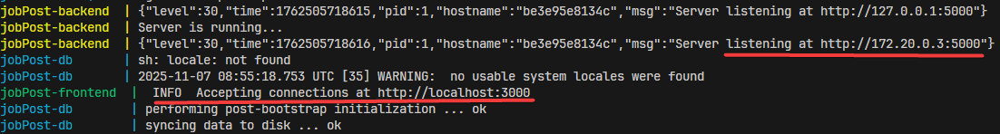

# Fullstack Job Posting Platform

### **Overview**

A side project built to **integrate and containerize** the frontend, backend, and database for a simple job posting platform.

* **Employers** can add and manage job postings.
* **Job seekers** can browse available jobs.

---

### **Features**

* Full **CRUD** functionality
* **Responsive** UI design
* Simple and lightweight container setup

---

### **Technologies Used**

[](https://skillicons.dev)

### Frontend

* **Framework:** React
* **Styling:** Tailwind CSS, React Icons, React Spinners
* **Notifications:** React Toastify
* **API Calls:** TanStack React Query
* **Routing:** React Router

### Backend

* **Framework:** Fastify

### Database

* **PostgreSQL**

### Containerization

* **Docker** & **Docker Compose**

---

### 🔌 API Endpoints

|  Method  | Endpoint       | Description                                   |
| :------: | -------------- | --------------------------------------------- |
|   `GET`  | `/jobs/recent` | Fetch the latest 3 job postings               |
|   `GET`  | `/jobs`        | List all available jobs                       |
|   `GET`  | `/jobs/:id`    | Retrieve detailed info for a specific job     |
|  `POST`  | `/jobs`        | Create a new job posting *(JSON payload)*     |
|   `PUT`  | `/jobs/:id`    | Edit an existing job posting *(JSON payload)* |
| `DELETE` | `/jobs/:id`    | Delete a job posting                          |

---

### **How to Run**

>**Prerequisites**
>* Docker installed
>* Ports **3000**, **5000**, and **9000** are free


1. Run below commands
```bash
git clone https://github.com/Mecha-Coder/Fullstack-Job-Posting.git
cd Fullstack-Job-Posting
make
```

2. Wait for setup to complete. If successful, you’ll **not** see any `exit` messages, and the following logs will appear:




3. Then, open your browser and visit:
👉 **http://localhost:3000**

4. To terminate the running containers and remove all resources, press Ctrl + C followed by `make clean`.
---

### Make Commands

Project is managed using **CMake** for simplicity.

| Command      | Description                          |
| :----------- | :----------------------------------- |
| `make`       | Build and run all containers         |
| `make stop`  | Stop running containers              |
| `make start` | Restart containers                   |
| `make clean` | Remove containers and related images |
| `make re`    | Clean and rebuild everything         |

